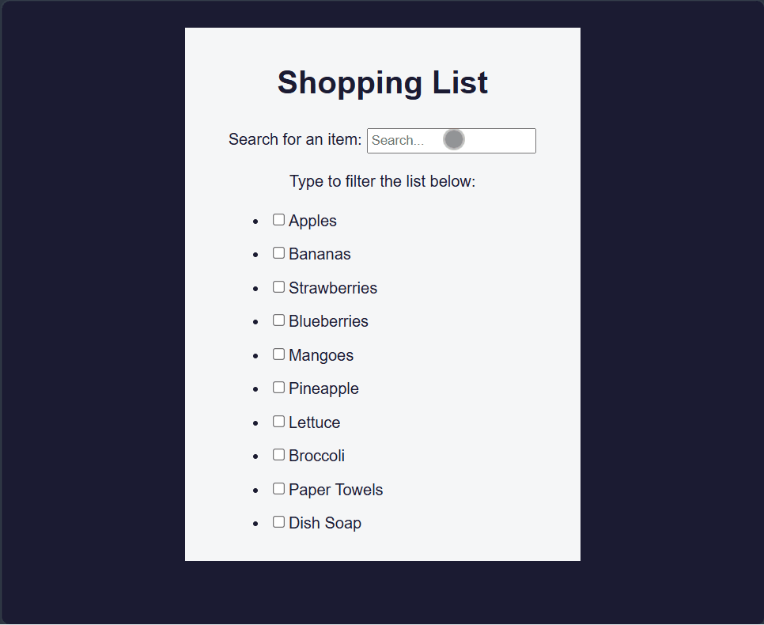

# 🛒 Shopping List App

A simple yet powerful **Shopping List App** built with **React, Vite, and TypeScript**.
This project demonstrates **memoization in React** using useMemo and useCallback to optimize rendering and performance.

---

## 🚀 Live Demo

[View Project](https://himanshu-kumar-2301.github.io/fcc-shopping-list-app/)

---

## 🛠️ Tech Stack

- **React 19** - UI components
- **TypeScript** - type safety
- **Vite** - build tool & dev server
- **ESLint** - linting & code quality

---

## 📸 Preview



---

## 📚 Features

- Filter and mark shopping list items.
- Memoization techniques:
  - useMemo → caches expensive calculations (e.g., derived item counts, filtered lists).
  - useCallback → memoizes event handlers to prevent unnecessary re-renders.
- Clean and responsive UI.
- Built with Vite for fast development and bundling.
- Written in TypeScript for type safety.

---

## 📂 Project Structure

```code
root/
|--public/
|--src/
|  |--styles.css
|  |--main.tsx
|  |--components/
|  |  └──ShoppingList.tsx
|  └──assets/
|     └──screenshot.gif
|--index.html
|--package.json
|--vite.config.ts
|--tsconfig.json
|--README.md
```

---

## ⚡ Getting Started

1. Clone the repo:

    ```bash
    git clone https://github.com/Himanshu-Kumar-2301/fcc-shopping-list-app.git
    ```

2. Navigate into the folder

    ```bash
    cd fcc-shopping-list-app
    ```

3. Install dependencies

    ```bash
    npm install
    ```

4. Start the dev server

    ```bash
    npm run dev
    ```

---

## 📖 Learning Highlights

- Using useMemo to cache computed values.
- Using useCallback to memoize functions passed as props.
- Understanding performance optimization in React apps.
- Structuring a TypeScript + React + Vite project for scalability.

---
